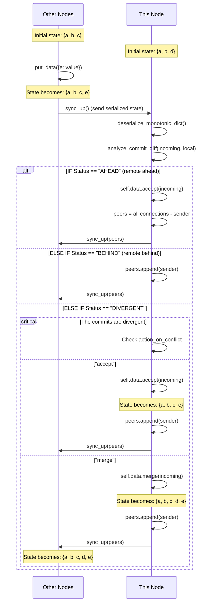

# Architecture

## 1. Data Format

### 1.1 Operation (Op) Structure

Operations are represented as frozen dataclasses ensuring immutability:

```python
@dataclass(frozen=True)
class Op:
    kind: str            # 'set', 'del', 'update', 'clear'
    args: Tuple[Any, ...]
```

**Operation Semantics:**

- `set`: `args = (key, value)` - Single key assignment
- `del`: `args = (key,)` - Key deletion
- `update`: `args = (mapping,)` - Bulk update from dictionary
- `clear`: `args = ()` - Clear all keys

### 1.2 MonotonicDict Internal Structure

The `MonotonicDict` maintains state as two parallel lists:

```python
self._commit_keys: list[str] = []      # Ordered list of UUIDs
self._commit_values: list[Op] = []     # Parallel list of operations
self._materialized_cache: Dict[Any, Any] = {}  # Cached materialized state
self._materialized_cursor = None       # Last materialized commit UUID
```

Index `i` in `_commit_keys` contains the UUID for the operation at index `i` in `_commit_values`.

### 1.3 Network Serialization Format

The complete state is serialized as JSON with the following schema:

```json
{
  "commit_keys": ["uuid1", "uuid2", ...],
  "commit_values": [
    {"kind": "set", "args": ["key", "value"]},
    {"kind": "del", "args": ["key"]},
    ...
  ]
}
```

**Serialization Process:**

1. Extract `_commit_keys` list directly
2. Transform each `Op` object to dictionary with `kind` and `args`
3. Convert `args` tuple to list for JSON serialization
4. Encode entire structure as JSON string

### 1.4 Deserialization Process

Upon receiving a payload, nodes reconstruct the `MonotonicDict` by:

1. Parse JSON payload
2. Create empty `MonotonicDict` instance
3. Restore `_commit_keys` from payload
4. Reconstruct `Op` objects by converting `args` back to tuples
5. Set `_commit_values` with reconstructed operations

---

## 2. Extended Abstract Mechanism: Data Reception Flow

When a node receives data from a peer, the following high-level sequence occurs:




**Key Flow Characteristics:**

- Deserialization occurs immediately upon receipt
- Commit analysis determines the relationship between local and remote states
- Conflict resolution policies are applied only when states diverge
- Propagation excludes the original sender to prevent echo effects

---

## 3. Individual Concepts and Definitions

### 3.1 Commit Analysis

The `analyze_commit_diff` function determines the relationship between two commit histories using set operations on UUID sets.

**Status Determination:**

1. `SAME`: `commits_A == commits_B` - Both nodes have identical commit sets
2. `AHEAD`: `commits_A ⊇ commits_B` AND `commits_A ≠ commits_B` - Local node has commits not present in remote
3. `BEHIND`: `commits_B ⊇ commits_A` AND `commits_A ≠ commits_B` - Remote node has commits not present in local
4. `DIVERGENT`: `commits_A ⊄ commits_B` AND `commits_B ⊄ commits_A` - Both nodes have unique commits

### 3.2 Conflict Resolution Policies

When commits diverge, nodes apply one of the following policies based on `action_on_conflict`:

| Policy | State Change | Propagation | Warning | Exception |
|--------|-------------|-------------|---------|-----------|
| `accept` | `self.data.accept(incoming_data)` | Yes (includes sender) | Yes | No |
| `merge` | `self.data.merge(incoming_data)` | Yes (includes sender) | Yes | No |
| `warn` | None | No | Yes | No |
| `exception` | None | No | No | Yes |
| `ignore` | None | No | No | No |

### 3.3 State Materialization

Read operations materialize the dictionary state by replaying the operation log. A cursor-based optimization avoids full log replay on consecutive reads.

**Materialization Algorithm:**

1. Fast path: If cursor points to last commit, return cached state
2. Position cursor: Find cursor's index in commit log, or -1 if not found
3. Extract pending operations: Slice log to get only unprocessed operations
4. Replay operations: Apply each pending operation to cache
5. Update cursor: Set cursor to last processed commit

---

## 4. Semantics and Subprocedures

### 4.1 Accept Algorithm (try_accept)

The `try_accept` function implements a non-conflicting merge by appending only missing commits while preserving order.

**Algorithm:**
```python
def try_accept(existing_data: MonotonicDict, incoming_data: MonotonicDict):
    dummy_dict = MonotonicDict()
    dummy_dict._commit_keys = existing_data._commit_keys.copy()
    dummy_dict._commit_values = existing_data._commit_values.copy()
    
    existing_commits = set(existing_data._commit_keys)
    
    for commit_id, op in zip(incoming_data._commit_keys, incoming_data._commit_values):
        if commit_id not in existing_commits:
            dummy_dict._commit_keys.append(commit_id)
            dummy_dict._commit_values.append(op)
    
    return dummy_dict
```

**Properties:**

- Preserves existing commit order
- Appends incoming commits in their original order
- Assumes no conflicting operations (last-write-wins at materialization time)
- O(n) complexity where n is the length of incoming commit log

### 4.2 Merge Algorithm

The `merge` function implements a conflict resolution strategy by concatenating histories and creating a unified update operation.

**Algorithm:**
```python
def merge(self, incoming_data):
    merged_data = {**self.to_dict(), **incoming_data.to_dict()}
    
    merged_monotonic_dict = MonotonicDict()
    merged_monotonic_dict._commit_keys = self._commit_keys
    merged_monotonic_dict._commit_values = self._commit_values
    merged_monotonic_dict._commit_keys += incoming_data._commit_keys
    merged_monotonic_dict._commit_values += incoming_data._commit_values
    merged_monotonic_dict._append_op(Op("update", (merged_data, )))
    
    is_sane = _check(merged_monotonic_dict, self, incoming_data)
    if is_sane:
        self._commit_keys = merged_monotonic_dict._commit_keys
        self._commit_values = merged_monotonic_dict._commit_values
    return is_sane
```

**Properties:**

- Preserves complete history from both branches
- Uses Python dict merge semantics (right-hand side wins for conflicts)
- Creates a new "merge commit" representing the unified state
- O(n + m) complexity where n, m are lengths of respective commit logs

### 4.3 Merge Validation (_check)

The `_check` function validates merge correctness by ensuring no data loss occurs.

**Validation Logic:**
```python
def _check(merged_data, existing_data, incoming_data):
    _edata = existing_data.to_dict()
    _idata = incoming_data.to_dict()
    _mdata = merged_data.to_dict()
    
    for _e in _edata:
        if _e not in _mdata:
            return False
    
    for _i in _idata:
        if _i not in _mdata:
            return False
    
    return True
```

**Guarantees:**

- No key deletion during merge
- Union of key sets is preserved
- Value conflicts resolved by last-write-wins (incoming wins in dict merge)

---

## 5. Policies and Implementation Details

### 5.1 Transport Layer Abstraction

The `WebSocketProtocol` class provides a unified interface for both client and server WebSocket connections, abstracting the differences between `websockets.ClientConnection` and `fastapi.WebSocket`.

**Type Dispatch Logic:**
```python
async def send_text(self, data: str):
    if self.ws_type is websockets.ClientConnection:
        await self.ws.send(data)
    elif self.ws_type is WebSocket:
        await self.ws.send_text(data)
```

### 5.2 Peer Propagation Logic

The `sync_up_recv` method prevents echo effects by excluding the sender from propagation:

```python
peers = list(self.connections.keys())
if sender in peers:
    peers.remove(sender)
```

### 5.3 Public API Transaction Methods

**put_data:** Inserts/updates key-value pairs and propagates changes via `sync_up()`

```python
async def put_data(self, key_value_pairs: Dict):
    for key, value in key_value_pairs.items():
        self.data[key] = value  # Each creates a separate Op
    await self.sync_up()
```

**get_data:** Retrieves value after ensuring synchronization

```python
async def get_data(self, key, default=None):
    await self.sync_up()
    return self.data.get(key, default)
```

**pop_data:** Removes key if present and propagates change

```python
async def pop_data(self, key, default=None):
    if key in self.data:
        value = self.data.pop(key)
        await self.sync_up()
        return value
    return default
```

### 5.4 Connection Management

**Client-Side Connection (join):**

```python
async def join(self, urls: List[str], token: str = ""):
    for url in urls:
        ws = await websockets.connect(url)
        self.connections[url] = WebSocketProtocol(ws)
        asyncio.create_task(self._listen(ws, url))
    await asyncio.sleep(1)
    await self.sync_up()
```

**Server-Side Connection (/mesh endpoint):**

```python
@self.app.websocket("/mesh")
async def websocket_endpoint(websocket: WebSocket):
    await websocket.accept()
    peer = str(websocket.client)
    self.connections[peer] = WebSocketProtocol(websocket)
    try:
        while True:
            data = await websocket.receive_text()
            await self.recv(peer, data)
    except Exception as ex:
        pass  # Silent disconnect handling
```
