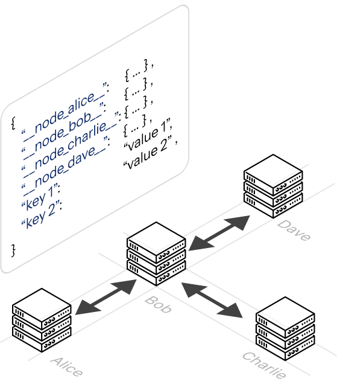

---
hide:
  - navigation
---

# Welcome to Mesh

<!--  -->
<!--  -->

Mesh is a distributed synchronization library designed for FastAPI applications. It enables multiple independent service instances to form a peer-to-peer network and maintain a shared, eventually consistent state store.

The library solves the problem of state distribution in decentralized environments without requiring a central database. It uses an append-only operation log and WebSocket-based synchronization to ensure that all nodes in the mesh eventually converge on the same data.

## When to use
Mesh is purpose-built for situations where multiple FastAPI replicas need to agree on a piece of shared state without paying the cost of a centralised store. Consider Mesh when you need any of the following:

- **Distributed caches**: Share computed results across replicas so that every instance can serve warm data, even if it wasn’t the one that originally computed it.
- **Cluster membership registries**: Let each node register its own presence at startup and deregister on shutdown, giving every peer a live view of who is in the cluster.
- **Shared configuration across replicas**: Propagate runtime configuration flags or feature toggles to all running instances without a restart or a config-server round-trip.
- **Leaderless coordination**: Implement soft consensus and coordination patterns (such as work-claiming or token passing) where no single node is a single point of failure.

Mesh is intentionally minimal. It does not replace a database for durable storage, and it does not guarantee strong consistency. If your use case requires strict linearisability or persistence across full cluster restarts, a dedicated store is a better fit.


## How mesh works
When you create a `Node` and pass it your FastAPI `app`, Mesh automatically registers a `/mesh` WebSocket endpoint on that application. Any other Mesh node in your network can open a persistent connection to that endpoint. 

To join an existing cluster, you call `await node.join(["ws://other-host/mesh"])`. This opens an outgoing WebSocket connection to the target node and spawns a background listener task that continuously receives state updates. Once connected, you call `await node.sync_up()` to push your local state to all peers. 

Shared data lives in a **MonotonicDict**, a dictionary-like structure that tracks a commit log alongside its values. When two nodes exchange state, Mesh compares their commit histories to decide whose version is newer, whether one is ahead of the other, or whether the histories have diverged. The `action_on_conflict` parameter you pass to Node controls what happens in the divergent case: `"merge"` combines both sides, `"accept"` adopts the remote state, and `"warn"` or `"exception"` give you manual control. 

You interact with the shared state through three async methods, `put_data()`, `get_data()`, and `pop_data()`, and you can read a plain Python dictionary snapshot at any time via `node.data.to_dict()`.

## How to use
Installing mesh can be done using a pip install command, through github.

```bash
$ pip install git+https://github.com/arnavdas88/mesh.git
```

Once the package is installed, integrating Mesh into a FastAPI application involves initializing a Node object and wiring it into the FastAPI lifespan handler. This ensures that the node can perform startup tasks (like joining peers) and graceful shutdown tasks (like removing its data from the mesh).

```python
import socket
import asyncio

from fastapi import FastAPI, Body
from mesh.node import Node

NAME = socket.gethostname()


app = FastAPI(title=f"Test Server {NAME}", )
node = Node(name=NAME, app=app, action_on_conflict="merge") # (1)!


@app.get("/")
async def root():
    internal_data = node.data.to_dict() # (2)!
    return {"name": NAME, "status": "running", "internal_data": internal_data}


@app.get("/join")
async def join(url: str):
    await node.join([url]) # (3)!
    await node.sync_up()
    await asyncio.sleep(2)  # Wait some time for the data to synchronize

    internal_data = node.data.to_dict()
    return {"name": NAME, "status": "running", "internal_data": internal_data}

@app.post("/push-data")
async def push(payload: dict = Body(...)):
    await node.put_data(payload)
    await asyncio.sleep(2) # Wait some time for the data to propagate

    internal_data = node.data.to_dict()
    return {"name": NAME, "status": "running", "internal_data": internal_data}
```

1. This instantiates a node object that maintains and manages the data structure for that server.
2. `node.data` contains the data that gets distributed all over the network.
3. This tells the node object to join a url of a mesh network with other similar nodes. After a join operation, a `node.sync_up(...)` is always suggested, to ensure that the data state has been synchronized accordingly.